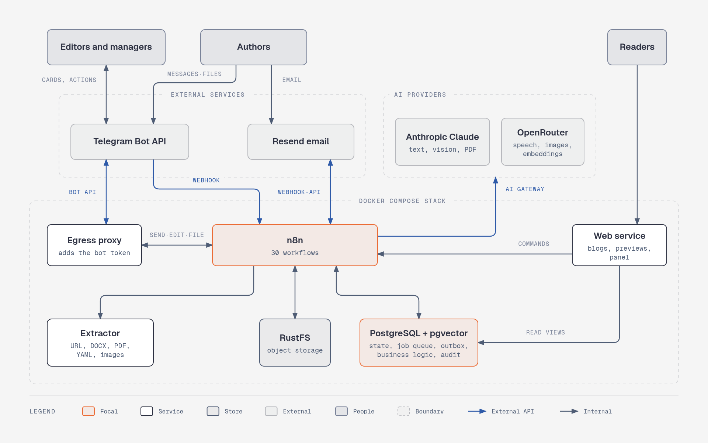
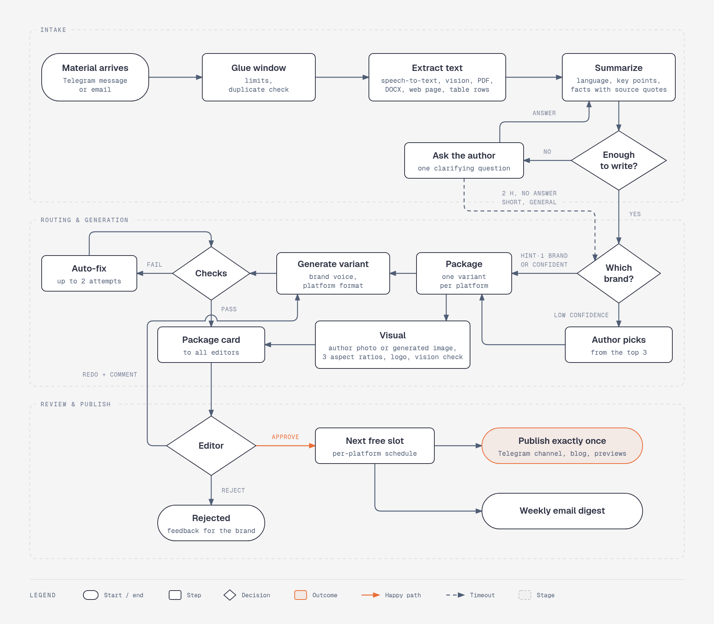
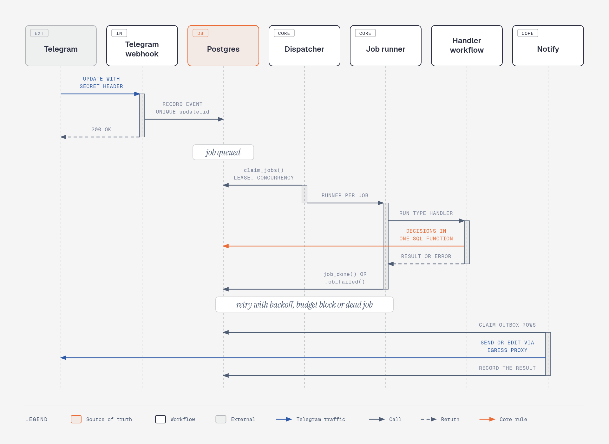
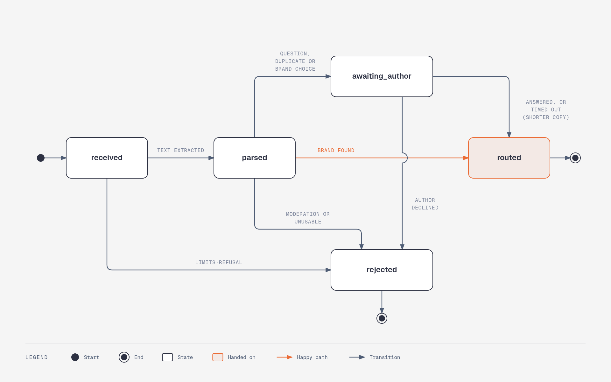
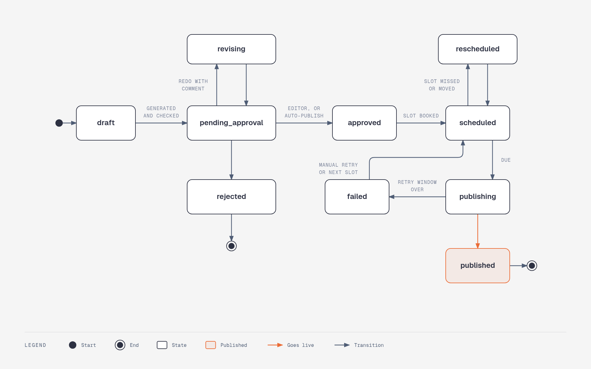
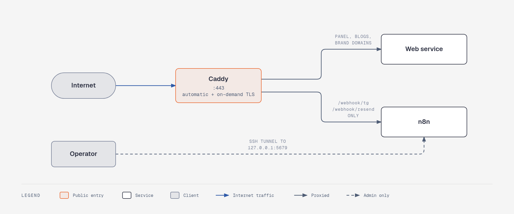

# AI Content Factory

**One Telegram bot in, brand-ready content out: for many brands at once.**

Authors send raw material: a voice note, a few lines of text, photos, a PDF, a spreadsheet, a link or an email. The factory works out which brand it belongs to. It writes a variant for every platform of that brand in the brand's own voice, with a matching visual, and checks every fact against the source. The package then goes to the brand's editors in Telegram. Approved posts are published on schedule to the brand's **Telegram channel**, its **blog** and a weekly **email digest**. **LinkedIn, Instagram, Facebook and X** get faithful previews.


> **Status:** the MVP is feature-complete. It is verified end to end against stubbed external APIs: 7 database scenario suites and 12 end-to-end scenarios that run the real n8n workflows. Running it live requires your own Telegram bot and Anthropic, OpenRouter and Resend accounts.

## Contents

- [Highlights](#highlights)
- [How it works](#how-it-works)
- [Tech stack](#tech-stack)
- [Repository layout](#repository-layout)
- [Getting started](#getting-started)
- [Configuration](#configuration)
- [Using the bot](#using-the-bot)
- [Web service](#web-service)
- [Testing](#testing)
- [Deployment](#deployment)
- [Security model](#security-model)
- [Operations](#operations)
- [Development workflow](#development-workflow)
- [Troubleshooting](#troubleshooting)

## Highlights

- **Any input, one inbox.** Text, voice and audio, photos, PDF, DOCX, XLSX/CSV and links arrive through one Telegram bot. Each author also gets a personal email address. Messages sent within a minute are merged into one material, and duplicates are detected. Authors can add free-form hints: brand, platforms, date, tone, "digest only", "urgent".
- **Understands before it writes.** It transcribes speech, describes images and reads PDFs (including scans). The summary records facts with verbatim source quotes. When the material is too thin, the bot asks the author one clarifying question instead of inventing.
- **Brand routing with isolation.** The brand comes from an explicit hint or the author's single brand. Otherwise a classifier chooses among the author's own brands only. Low confidence means the author picks from the top three.
- **On-brand, per-platform variants.** Each variant gets the brand's voice, vocabulary, required elements and examples, plus the editors' latest feedback. The visual is the author's photo or a generated image, cropped to 16:9, 1:1 and 4:5, given the brand logo and vision-checked for text, people and logos.
- **Automatic checks and fixes.** Checks cover length, forbidden words, required elements, links, facts against the source, language, forbidden topics and repeated topics (via embeddings). Failing drafts are fixed automatically before an editor sees them.
- **Approval in Telegram.** All editors see a live package card. From it they can approve, edit, redo with a comment, swap the headline, change the time, replace the visual, reject or redirect to another brand. Edits and rejections become examples the brand learns from.
- **Exactly-once publishing.** Per-platform schedules are enforced (slots, daily caps, minimum intervals). Each attempt is recorded with an idempotency key before the call. Failures are retried with backoff for 30 minutes. An unknown outcome goes to a human, and a stop switch covers the system, a brand or a platform. Published posts can be edited or deleted from the card.
- **Weekly email digest.** It is built two hours before sending from approved blocks and relevant topics from the brand's RSS sources. Editors can send a test and approve. Sending uses batches with idempotency keys, delivery events are verified, and subscription is double opt-in with one-click unsubscribe.
- **Operations built in.** AI budgets are kept per brand, guest, eval and system; at 100% generation stops while intake continues. There are health alerts with an external heartbeat, an append-only audit log, a full trace and cost for every material, weekly reports and a read-only web panel.
- **Guest demo mode.** Anyone can send material for a demo brand, or for a temporary brand built from one sentence. They get a preview package, nothing is published, and a daily limit plus a separate budget apply.

## How it works

### System overview



The design rests on three rules:

- **Postgres is the source of truth; n8n executes steps.** State transitions, slot booking, job claiming and budgets are atomic SQL functions, so a workflow node calls one function. n8n holds no state between steps: no static data and no long waits.
- **Record first, answer fast.** Every webhook writes the raw event under a unique external ID, acknowledges immediately and queues a job. Redelivered updates create nothing.
- **Everything the bot says goes through an outbox.** One message is in flight per chat, cards and acknowledgements are sent once and then edited in place, and rate limits (`429 retry_after`) are honoured.

### Content pipeline



### Execution model

Every unit of work is a row in `jobs`. Each job type maps to a handler workflow. Concurrency per type, leases, retries with backoff and dead jobs are all handled in one place.



If n8n dies mid-step, the lease expires and the job runs again from the last committed state. The end-to-end suite verifies this by restarting n8n during an in-flight AI call.

### Lifecycles

Every status change goes through one SQL function (`transition`) that validates it against an allowed graph and writes the audit log.



_Material lifecycle._



_Variant lifecycle. Any state before `publishing` can also become `cancelled` (removal, redirect to another brand). Digest issues follow the same graph plus `skipped`, used when there are too few blocks or no approval by send time._

<details>
<summary><b>Workflow map (30 workflows)</b></summary>

| Area | Workflow         | Trigger                   | Responsibility                                                                         |
| ---- | ---------------- | ------------------------- | -------------------------------------------------------------------------------------- |
| CORE | Dispatcher       | every 10 s + direct call  | Claims ready jobs (leases, concurrency, expired-lease recovery), starts runners        |
| CORE | Job runner       | sub-workflow              | Runs a job's handler, records `job_done` / `job_failed`, fast path to the next work    |
| CORE | SQL job          | job                       | Job types that are pure database logic (updates, cards, deadlines, plans, reports)     |
| CORE | AI gateway       | sub-workflow              | The only caller of AI providers: budget check first, request building, usage and cost  |
| CORE | Notify           | every 5 s + direct call   | Outbox sender: per-chat ordering, send-then-edit slots, retries, blocked-bot detection |
| CORE | Error handler    | Error Trigger             | Stores failed executions, alerts admins at most once per workflow per 15 min           |
| CORE | Cron             | every minute              | Enqueues periodic jobs idempotently (health, housekeeping, digests, reports, feeds)    |
| CORE | Tg file          | sub-workflow              | Downloads a Telegram file through the egress proxy into object storage                 |
| IN   | Telegram webhook | webhook `/webhook/tg`     | Single bot entry point: record update, answer 200, queue processing                    |
| IN   | Email webhook    | webhook `/webhook/resend` | Inbound email and delivery events; data is re-fetched from the Resend API              |
| IN   | Email fetch      | job                       | Email plus attachments into storage, sender and limits check, acknowledgement          |
| IN   | Web commands     | webhook `/webhook/cmd`    | Subscribe, confirm, unsubscribe, delete: the web service never writes state itself     |
| PIPE | Extract          | job                       | One material part to text: web page, voice, image, PDF, DOCX, table                    |
| PIPE | Summarize        | job                       | Summary, language, facts, sufficiency, guest moderation; then duplicates or routing    |
| PIPE | Route            | job                       | Brand detection limited to the author's brands                                         |
| PIPE | Generate         | job                       | Write, redo with comment, or fix one variant for its platform                          |
| PIPE | Check            | job                       | Links, facts, language, forbidden topics, repeated topics                              |
| PIPE | Visual           | job                       | Package visual in every needed aspect ratio, logo, vision check                        |
| PUB  | Publisher        | every 30 s + direct call  | Exactly-once publishing, retries, unknown outcome, stop switch                         |
| PUB  | Post ops         | job                       | Edit or delete a published post                                                        |
| DG   | Build            | job                       | Digest issue: blocks, feed topics, HTML, test send, approval card                      |
| DG   | Send             | job                       | Batch sending in chunks of 100 with an idempotency key per chunk                       |
| DG   | Feeds            | job                       | Brand RSS sources, relevance by embedding similarity                                   |
| DG   | ESP events       | job                       | Delivery, open, click, bounce and complaint, verified through the API                  |
| ADM  | Onboarding       | job                       | Draft brand profile from 5–10 sample posts                                             |
| ADM  | Profile YAML     | job                       | Brand config export and import as YAML through the bot, schema check, versions         |
| ADM  | Guest brand      | job                       | Temporary preview-only brand from a one-sentence description                           |
| ADM  | Health           | job, every 5 min          | Queue, error-rate and dead-job alerts, external heartbeat                              |
| ADM  | Housekeeping     | job, daily                | Expired guest data and files, sessions, tokens, old events                             |
| EVAL | Run              | manual or `/eval`         | Reference set through the real pipeline under a separate budget                        |

</details>

## Tech stack

| Layer                   | Technology                                                                                           |
| ----------------------- | ---------------------------------------------------------------------------------------------------- |
| Orchestration           | n8n 2.40 in regular mode, backed by its own Postgres database                                        |
| State, queue and logic  | PostgreSQL 17 with `pgvector` and `pg_trgm`; business logic in PL/pgSQL                              |
| Language models         | Anthropic Messages API, `claude-opus-5-5`: structured outputs, prompt caching, PDF and vision input  |
| Speech, images, vectors | OpenRouter: `whisper-large-v3-turbo`, `gemini-2.5-flash-image`, `text-embedding-3-small` (1536 dims) |
| Email                   | Resend: batch API with idempotency keys, inbound email, delivery events                              |
| Messaging               | Telegram Bot API through a Caddy egress proxy that injects the bot token                             |
| Object storage          | RustFS (S3-compatible)                                                                               |
| Document utilities      | Node.js 22 service: Readability + linkedom, mammoth, sharp, yaml, Ajv; SSRF-guarded fetching         |
| Web                     | Next.js 16 (App Router, server-rendered), React 19, `pg`                                             |
| Edge (production)       | Caddy 2.11 with automatic and on-demand TLS                                                          |

## Repository layout

| Path                    | Contents                                                                                               |
| ----------------------- | ------------------------------------------------------------------------------------------------------ |
| `db/migrations/`        | Forward-only schema migrations, tracked in `schema_migrations`                                         |
| `db/functions/`         | Business logic, read models (`panel.*`, `site.*`), grants and seed config; re-applied on every migrate |
| `db/tests/`             | Database scenario tests: the whole pipeline with a fake executor in place of n8n                       |
| `n8n/workflows/`        | 30 workflows with stable IDs; the JSON files are the source of truth                                   |
| `prompts/`              | One prompt per AI route (`<route>.md`) and response schemas (`prompts/schemas/`)                       |
| `templates/`            | Every bot text (`bot.en.json`) and the digest email template                                           |
| `config/platforms.json` | Platform formats: length limits, structure, image aspect ratios                                        |
| `schemas/`              | JSON Schema of the brand profile                                                                       |
| `seed/brands/`          | Demo brands in the same YAML format the bot exports                                                    |
| `eval/cases/`           | Reference set: 30 generation cases and 16 routing cases                                                |
| `extractor/`            | Internal document service (URL text, DOCX, PDF pages, YAML, schema validation, image fitting)          |
| `web/`                  | Next.js service: brand blogs, subscriptions, previews, read-only panel, case page                      |
| `infra/`                | Caddy configs: the egress proxy and the production edge proxy                                          |
| `stub/`                 | Fake Telegram, Anthropic, OpenRouter and Resend for end-to-end tests                                   |
| `scripts/`              | Setup, sync, import, tests, backups                                                                    |
| `docker-compose.yml`    | Local stack; `docker-compose.prod.yml` adds the production overlay                                     |

## Getting started

### Prerequisites

- Docker Engine with the Compose plugin, plus `python3`, `curl` and `openssl` on the host.
- A dedicated Telegram bot for development, created with [@BotFather](https://t.me/BotFather). Telegram allows one webhook per bot, so dev and prod each need their own.
- A public HTTPS URL that forwards to n8n, so Telegram and Resend can reach the webhooks. In development a tunnel works, for example `cloudflared tunnel --url http://localhost:5679`.
- API keys for Anthropic, OpenRouter and Resend.

### Setup

**1. Create `.env`.** This generates every local secret and leaves the external keys empty.

```bash
./scripts/setup-env.sh
```

Then set `TELEGRAM_BOT_TOKEN` and `PUBLIC_N8N_URL` in `.env`.

**2. Start the stack.**

```bash
docker compose up -d --build
```

**3. Apply the schema and load the repository config** (bot texts, platform formats, prompts, schemas, eval cases).

```bash
./scripts/db-migrate.sh
./scripts/sync-config.sh
./scripts/s3-init.sh
```

**4. Create the n8n credentials.** Open http://localhost:5679 and create the owner account. Then run the script below. It creates the missing credentials under stable IDs and never overwrites existing ones.

```bash
./scripts/n8n-credentials.sh
```

If an API key was not in `.env`, the credential is created with the placeholder `FILL_IN_IN_N8N_UI`. Paste the real key in n8n under **Credentials**: `Anthropic API`, `OpenRouter API`, `Resend API`.

**5. Import and publish the workflows.**

```bash
./scripts/n8n-lint.sh
./scripts/n8n-import.sh
```

**6. Seed the demo brands.** Guest mode and the eval set use them.

```bash
./scripts/seed.sh
```

**7. Connect the bot and invite the first admin.**

```bash
./scripts/tg-set-webhook.sh
./scripts/admin-invite.sh
```

Open the printed `t.me/...?start=...` link and press **Start**. The link is valid for 72 hours and works once. From then on, everything is managed through the bot.

### Local endpoints

| Service          | URL                                                         |
| ---------------- | ----------------------------------------------------------- |
| n8n editor       | http://localhost:5679                                       |
| Web service      | http://localhost:3001                                       |
| PostgreSQL       | `localhost:5433`                                            |
| Object storage   | S3 API http://localhost:9000, console http://localhost:9001 |
| API stub (tests) | http://localhost:3902 (`--profile test`)                    |

## Configuration

Configuration lives in four places: secrets in `.env` and n8n credentials, behaviour in the `settings` table, AI routing in `ai_routes`, and texts and prompts in the repository.

### Environment variables

| Variable                                                                                             | Purpose                                                                        |
| ---------------------------------------------------------------------------------------------------- | ------------------------------------------------------------------------------ |
| `POSTGRES_PASSWORD`, `APP_OWNER_PASSWORD`, `APP_N8N_PASSWORD`, `APP_WEB_PASSWORD`, `N8N_DB_PASSWORD` | Database roles (generated)                                                     |
| `S3_ACCESS_KEY`, `S3_SECRET_KEY`, `S3_BUCKET`                                                        | Object storage (generated)                                                     |
| `TELEGRAM_WEBHOOK_SECRET`                                                                            | Verifies that webhook calls come from Telegram                                 |
| `WEB_CMD_SECRET`                                                                                     | Authenticates web service → n8n command calls                                  |
| `WEB_SESSION_SECRET`                                                                                 | Signs outbound redirect links on the blogs                                     |
| `TELEGRAM_BOT_TOKEN`                                                                                 | Read only by the egress proxy; never reaches n8n                               |
| `ANTHROPIC_API_KEY`, `OPENROUTER_API_KEY`, `RESEND_API_KEY`                                          | Optional: copied into n8n credentials once by `n8n-credentials.sh`             |
| `N8N_ENCRYPTION_KEY`                                                                                 | Empty in dev; required in production, keep a copy outside the database backups |
| `N8N_API_KEY`                                                                                        | n8n public API key for tooling                                                 |
| `PUBLIC_N8N_URL`, `PUBLIC_WEB_URL`, `GENERIC_TIMEZONE`                                               | Public base URLs and the default time zone                                     |
| `ACME_EMAIL`, `N8N_DOMAIN`                                                                           | Production only: certificate account and the webhook host                      |
| `BACKUP_S3_ENDPOINT`, `BACKUP_S3_BUCKET`, `BACKUP_S3_ACCESS_KEY`, `BACKUP_S3_SECRET_KEY`             | Optional off-site backup target                                                |

### Runtime settings

Thresholds, limits, time-outs, budgets and API base URLs live in the `settings` table. Each has a global value and can be overridden per brand. Changing them never requires touching a workflow.

<details>
<summary><b>Selected settings and defaults</b></summary>

| Key                                     | Default              | Meaning                                                                    |
| --------------------------------------- | -------------------- | -------------------------------------------------------------------------- |
| `intake.glue_seconds`                   | `60`                 | Messages within this window form one material                              |
| `intake.max_file_bytes`                 | 20 MB                | Largest file (also the Telegram bot download limit)                        |
| `intake.max_audio_seconds`              | `600`                | Longest voice or audio message                                             |
| `intake.max_doc_pages`                  | `30`                 | Longest PDF or DOCX                                                        |
| `intake.max_table_rows`                 | `500`                | Largest content-plan table                                                 |
| `intake.duplicate_similarity`           | `0.85`               | Trigram similarity that counts as a near duplicate (30 days)               |
| `route.confidence_threshold`            | `0.75`               | Below it the author chooses the brand                                      |
| `gen.max_fix_attempts`                  | `2`                  | Automatic fixes before a variant goes to editors with warnings             |
| `gen.repeat_topic_days` / `_similarity` | `14` / `0.88`        | Repeated-topic warning                                                     |
| `approval.reminder_hours`               | `[12, 1]`            | Reminders before the proposed slot                                         |
| `publish.retry_window_minutes`          | `30`                 | Automatic retries before a post is marked failed                           |
| `publish.unknown_after_seconds`         | `180`                | A pending attempt older than this is an unknown outcome, so no blind retry |
| `digest.build_hours_before`             | `2`                  | When the issue is built                                                    |
| `digest.min_blocks` / `max_blocks`      | `2` / `7`            | Fewer blocks skip the issue                                                |
| `digest.feed_relevance`                 | `0.35`               | Minimum similarity for an external topic                                   |
| `budget.warn_ratio`                     | `0.8`                | Budget warning threshold                                                   |
| `guest.daily_materials`                 | `3`                  | Guest limit per day                                                        |
| `guest.monthly_budget_usd`              | `15`                 | Guest AI budget                                                            |
| `health.heartbeat_url`                  | empty                | External monitor URL pinged every 5 minutes                                |
| `email.inbound_domain`                  | `in.example.com`     | Domain of the personal intake addresses `in+<token>@domain`                |
| `email.from`                            | `digest@example.com` | Sender of system emails (verified domain in Resend)                        |

Brand budgets are set per brand: with `/budget <brand> <usd>` (admins) or `brand.monthly_budget_usd` in the brand YAML.

</details>

### AI routes and prompts

Each AI operation is a route in `ai_routes`: provider, model, parameters, prompt and response schema. Switching a model is a data change followed by an eval run, not a workflow edit.

| Route                                                 | Used for                                   | Default model                   | Effort       |
| ----------------------------------------------------- | ------------------------------------------ | ------------------------------- | ------------ |
| `extract.summary`                                     | Summary, facts, sufficiency, moderation    | `claude-opus-5-5`               | low          |
| `route.classify`                                      | Brand detection                            | `claude-opus-5-5`               | low          |
| `gen.variant`, `fix.variant`                          | Writing and fixing variants                | `claude-opus-5-5`               | medium       |
| `check.facts`                                         | Facts, language and forbidden-topic check  | `claude-opus-5-5`               | medium       |
| `image.brief`                                         | Image brief when no variant provided one   | `claude-opus-5-5`               | low          |
| `vision.describe`, `vision.pdf`, `vision.check_image` | Images, PDFs and scans, visual checks      | `claude-opus-5-5`               | low          |
| `digest.compose`, `digest.feed_block`                 | Digest intro and external-topic blocks     | `claude-opus-5-5`               | medium / low |
| `onboarding.profile`, `onboarding.quick`              | Brand profile from samples or one sentence | `claude-opus-5-5`               | high / low   |
| `stt`                                                 | Speech-to-text                             | `openai/whisper-large-v3-turbo` | —            |
| `image.generate`                                      | Visuals                                    | `google/gemini-2.5-flash-image` | —            |
| `embed`                                               | Repeated topics, feed relevance            | `openai/text-embedding-3-small` | —            |

Prompts live in `prompts/<route>.md`, split into three sections:

- `<<<system>>>` holds the rules;
- `<<<cache>>>` holds the stable brand material and is sent with `cache_control`, so the variants of one package share the prompt cache;
- `<<<user>>>` holds the material, which is marked as data and never as instructions.

Placeholders use `{{var}}`. `sync-config.sh` versions each prompt by SHA-256, and every AI call logs the prompt version it used.

## Using the bot

### Roles

Roles are granted per brand; admin is a global flag. Users only ever see the brands they belong to.

| Role    | Can                                                                                   |
| ------- | ------------------------------------------------------------------------------------- |
| Author  | Send materials, see the status and cost of their own materials                        |
| Editor  | Approve, edit, schedule and reject; pause publishing; build digests                   |
| Manager | Everything an editor can, plus the brand profile, onboarding, members and budget view |
| Viewer  | Read-only access to the brand in the panel and reports                                |
| Admin   | All brands, new brands, budgets, the system-wide stop switch, failed jobs, eval       |

### Commands

| Command                                                                     | Who             | Description                                     |
| --------------------------------------------------------------------------- | --------------- | ----------------------------------------------- |
| _any message or file_                                                       | author          | New material; hints in free form                |
| `/m <id>` or `/status M-<id>`                                               | author          | Full history and cost of a material             |
| `/intake`                                                                   | author          | Personal email address for materials            |
| `/notify each\|batch\|off`                                                  | author          | "Published" notifications                       |
| `/panel`                                                                    | all             | One-time login link for the web panel           |
| `/pause <brand> [platform]`, `/resume`                                      | editor          | Stop switch for a brand or platform, and resume |
| `/digest <brand> [now]`                                                     | editor          | Next issue status, or build it now              |
| `/report <brand>`                                                           | viewer          | Report for the last 7 days                      |
| `/myemail <address>`                                                        | editor          | Address for digest test sends                   |
| `/profile <brand>`                                                          | manager         | Brand config as YAML: edit it and send it back  |
| `/onboard <brand>` … `/done`                                                | manager         | Draft a profile from 5–10 sample posts          |
| `/examples <brand>`                                                         | manager         | Learned examples and anti-examples              |
| `/invite <role> <brand[,brand]>`, `/revoke @user <brand>`, `/users <brand>` | manager         | Members                                         |
| `/budget <brand> [usd]`                                                     | manager / admin | AI spend this month; admins set the budget      |
| `/newbrand <slug> <Name>`                                                   | admin           | Create a brand                                  |
| `/pause all`                                                                | admin           | Stop all publishing                             |
| `/jobs`, `/retry <job>`                                                     | admin           | Dead background jobs, and retry one             |
| `/eval [generation\|routing]`                                               | admin           | Run the quality reference set                   |
| `/demo`                                                                     | anyone          | Guest demo mode                                 |
| `/help`, `/cancel`                                                          | all             | Help for your roles; stop the current dialog    |

### Onboarding a new brand

1. An admin creates the brand: `/newbrand acme Acme Coffee`.
2. A manager runs `/onboard acme`, sends 5–10 existing posts (text or links) and finishes with `/done`. The bot returns a draft profile covering voice, audience, topics, facts, required elements and visual style, with an **Activate** button.
3. To fine-tune, `/profile acme` exports the full config as commented YAML: profile, platforms, schedules and RSS sources. Edit the file and send it back. It is validated against the schema and saved as a new version, which you then activate. Packages keep the profile version they were created with.

## Web service

One Next.js service serves every brand. Blogs work under the main host or on the brand's own domain.

| Path                                                   | Purpose                                                                                                                        |
| ------------------------------------------------------ | ------------------------------------------------------------------------------------------------------------------------------ |
| `/b/<brand>`, `/b/<brand>/<slug>`                      | Brand blog and articles (or `/<slug>` on the brand's own domain)                                                               |
| `/b/<brand>/subscribe`, `/confirm/…`, `/unsubscribe/…` | Double opt-in subscription; one-click unsubscribe (RFC 8058)                                                                   |
| `/p/<token>`                                           | "How it will look" previews for every platform                                                                                 |
| `/d/<token>`                                           | Digest issue preview                                                                                                           |
| `/r?v=…&u=…&s=…`                                       | Signed outbound redirect that counts clicks; never an open redirect                                                            |
| `/panel`                                               | Read-only panel via magic link: materials with a full trace and cost, calendar, queue, digests, reports with CSV export, audit |
| `/case`                                                | Public case study page with live numbers from the demo brands                                                                  |
| `/sitemap.xml`, `/robots.txt`                          | SEO for the requesting host                                                                                                    |
| `/api/tls-check`                                       | Host check for Caddy on-demand TLS                                                                                             |

The web service connects with a read-only role that can see only the `site.*` and `panel.*` views. Panel rows are filtered by the session user inside the database, so brand isolation does not depend on application code. State changes such as subscribe and unsubscribe are sent to n8n as commands.

## Testing

| Check                | Command                  | What it covers                                                                                                                                       |
| -------------------- | ------------------------ | ---------------------------------------------------------------------------------------------------------------------------------------------------- |
| Database scenarios   | `./scripts/db-test.sh`   | The whole pipeline with a fake executor: intake, routing, generation flow, approval, publishing, digest, panel isolation, budgets, every bot command |
| Workflow lint        | `./scripts/n8n-lint.sh`  | Connections, node references, called workflows, expressions after n8n's own rewrite                                                                  |
| End-to-end           | `./scripts/e2e.sh`       | Real n8n workflows against a stub of every external API (12 scenarios, about 3.5 min)                                                                |
| Load                 | `./scripts/e2e.sh table` | A 500-row content plan through real n8n: 0 lost, 0 duplicated (about 8 min)                                                                          |
| Extractor unit tests | see below                | SSRF guard, YAML round trip, profile validation, image fitting, PDF page count, HTTP endpoints                                                       |
| Web unit tests       | see below                | Markdown sanitising, signed redirects                                                                                                                |
| Content quality      | `/eval` in the bot       | Reference set through the real pipeline under its own budget                                                                                         |

The database suite runs on a throwaway database with production-equivalent privileges. Pass a filter to run one file: `./scripts/db-test.sh 30`.

The end-to-end suite switches the API base URLs to the stub for the duration of the run and restores them afterwards. Real external APIs are never called, and test data is removed at the end. It covers:

- text → brand → variants → card → publishing to the channel and the blog, including a redelivered update;
- editing and deleting a published post;
- a voice note with **n8n restarted during an in-flight AI call**: the step re-runs and no duplicate package appears;
- the author's photo as the visual; email with an attachment;
- an unavailable channel: retries, editors notified, then a manual retry that publishes exactly once;
- the stop switch;
- the brand config YAML round trip; onboarding from samples;
- the digest: RSS, build, test send, approval, batch send, delivery event;
- guest mode: previews only, plus a temporary brand built from one sentence;
- the eval run; an unknown sender.

```bash
docker compose --profile test up -d stub
./scripts/e2e.sh                 # all scenarios
./scripts/e2e.sh digest guest    # selected scenarios
KEEP=1 ./scripts/e2e.sh text     # keep the run's data for debugging
```

Unit tests of the extractor and the web service:

```bash
docker compose run --rm -T -v ./extractor/server.test.mjs:/app/server.test.mjs:ro extractor node --test /app/server.test.mjs
docker run --rm -u "$(id -u):$(id -g)" -v "$PWD/web:/app" -w /app node:22-alpine sh -c "npm ci && npm test"
```

## Deployment

Production runs on a single VPS with Docker Compose and the production overlay.



1. Use a separate production bot. Set `PUBLIC_N8N_URL`, `PUBLIC_WEB_URL`, `N8N_DOMAIN` (the host of `PUBLIC_N8N_URL`) and `ACME_EMAIL`. Set an explicit `N8N_ENCRYPTION_KEY` and store a copy outside the database backups.
2. Start the stack:

   ```bash
   docker compose -f docker-compose.yml -f docker-compose.prod.yml up -d --build
   ```

3. Run the setup steps from [Getting started](#setup) against the production `.env`.
4. Point brand domains at the server. Certificates are issued on the first request, and only for hosts the web service recognises.
5. Schedule the nightly backup from the host's cron. It dumps both databases, restores the application dump into a scratch database to prove it loads, uploads it to object storage (set `BACKUP_S3_*` for an off-site bucket) and keeps 14 days locally:

   ```cron
   15 3 * * * /srv/ai-content-factory/scripts/backup.sh
   ```

6. Set `health.heartbeat_url` to an external dead man's switch, such as a Healthchecks-style ping URL. The ping is sent by a queued job, so a stopped n8n, database or queue shows up as a missed heartbeat.

## Security model

- **Secrets stay in two places: `.env` and n8n credentials.** No secrets appear in workflow JSON, Code nodes, execution data, logs, the audit log or messages.
- **The bot token never reaches n8n.** The Bot API puts the token in the URL path, so n8n calls an internal egress proxy that adds it. Telegram webhooks are verified with a secret header.
- **Webhooks are notifications, not facts.** Inbound emails and delivery events are re-fetched from the Resend API with our own key before they are trusted.
- **Least-privilege database roles.**
  - `app_owner` owns the schema.
  - `app_n8n` performs business writes; it cannot alter the schema or rewrite the audit log.
  - `app_web` can only read the `site.*` and `panel.*` views.
- **Brand isolation is enforced in SQL.** The classifier only sees the author's brands. Panel views filter by the session user, and the isolation is covered by tests.
- **Preview, guest and eval content can never be published for real.** The publish target is decided in one SQL function, and those modes always resolve to the preview adapter.
- **Material is data, not instructions.** Prompts mark material as untrusted, the models have no side-effecting tools, outputs are schema-validated and checked, and only approved content is published.
- **Hardened fetching and links.** The extractor blocks private and loopback addresses, including after redirects. Blog links go through HMAC-signed redirects. Magic links are single-use and short-lived.
- **The audit log is append-only.** It records who did what and when, for intake, approval, edits, publishing and settings.

## Operations

- **Alerts to admins in Telegram.** They cover queue depth and age, AI and publishing error rates, dead jobs, failed workflow executions (at most once per workflow per 15 minutes) and budget thresholds at 80% and 100%.
- **Tracing.** `/m <id>` and the panel show every step, decision and AI call of a material, with its cost.
- **Failed jobs.** `/jobs` lists dead jobs; `/retry <job>` re-queues one.
- **Budgets.** At 100% generation is blocked while intake keeps working. Blocked jobs resume when the budget is raised or a new month starts.
- **Weekly reports.** Managers and viewers receive them in the brand's time zone. Panel reports export to CSV.
- **Retention.** Guest materials are deleted after 7 days and temporary brands after 72 hours. Sessions, tokens and old processed events are cleaned up daily.

## Development workflow

- **Database.** Edit `db/functions/*.sql` and run `./scripts/db-migrate.sh`; functions and views are re-created on every run. Schema changes go into a new file in `db/migrations/`.
- **Workflows.** The JSON in `n8n/workflows/` is the source of truth. After editing in the n8n UI, export the workflow (`n8n export:workflow --separate`) back into the repository. After editing the JSON, run `./scripts/n8n-lint.sh` and `./scripts/n8n-import.sh`. Sub-workflows run their _published_ version, which the import script handles.
- **Texts, prompts, platform formats, eval cases.** Edit the files and run `./scripts/sync-config.sh`.
- **Conventions.**
  - Postgres nodes use parameterised queries only, and multi-step logic belongs in a SQL function.
  - Code nodes are short pure transformations with no network calls.
  - Every workflow uses `CORE · Error handler` as its error workflow.
  - Exported workflows contain no pinned data.

## Troubleshooting

| Symptom                               | Likely cause                               | What to do                                                                                                      |
| ------------------------------------- | ------------------------------------------ | --------------------------------------------------------------------------------------------------------------- |
| The bot does not answer               | Webhook not set, tunnel down, wrong secret | Check `PUBLIC_N8N_URL`, re-run `./scripts/tg-set-webhook.sh`, inspect the executions of `IN · Telegram webhook` |
| Jobs die with `fatal: HTTP 401`       | Placeholder key in an n8n credential       | Paste the key under **Credentials**, then `/retry <job>`                                                        |
| Generation stops, intake still works  | Monthly budget reached                     | `/budget <brand>`; an admin can raise it with `/budget <brand> <usd>`                                           |
| Approved posts are not published      | A stop switch is active                    | `/resume` lists pauses with resume buttons                                                                      |
| Emails are not delivered              | Sender domain not verified in Resend       | Verify the domain and set `email.from`                                                                          |
| `e2e: API settings point at the stub` | An interrupted `KEEP=1` run                | Run `./scripts/e2e.sh` once: it restores the saved settings                                                     |
