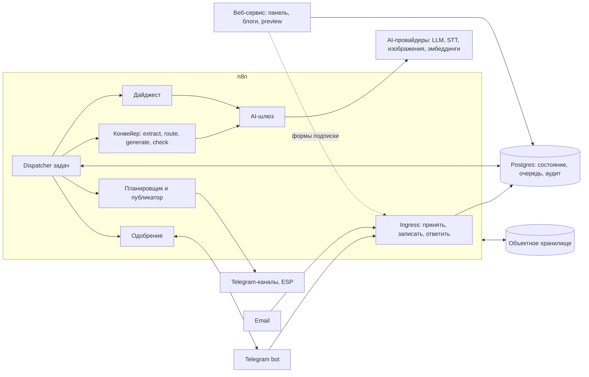
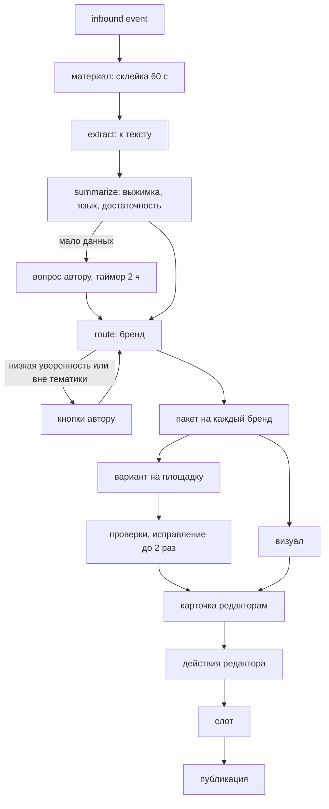

# AI Content Factory — архитектура и план реализации

Версия 0.1 · 29.09.2026 · живой документ

Технический документ, на который ссылается [tz.md](tz.md). ТЗ отвечает на вопрос «что», этот документ — «как». Коды требований (IN-1, GN-5 …) взяты из ТЗ.

---

## 0. Как пользоваться документом

Это карта, а не спецификация. Здесь зафиксированы принципы, границы компонентов и решения по умолчанию, чтобы разные агенты и люди строили систему в одном стиле. Детали (DDL, ноды, промпты) появляются при реализации и живут в коде, а не здесь.

| Уровень              | Где       | Можно ли менять                                                                                                 |
| -------------------- | --------- | --------------------------------------------------------------------------------------------------------------- |
| Инварианты           | §2.1      | Нет. Если инвариант мешает — остановиться и спросить человека                                                   |
| Решения по умолчанию | §2.2–§11  | Да, если по умолчанию выходит костыль или есть явно более простой путь. Значимое отклонение — запись в §13        |
| Открытые вопросы     | §12       | Решаются при реализации по указанным критериям, итог — запись в §13                                             |

**Отклоняйся от плана, если** план ведёт к костылю (признаки ниже), n8n или внешний API ведут себя не так, как здесь предполагается, или есть решение проще при тех же инвариантах.

**Спроси человека, если** нарушается инвариант; меняется скоуп (MVP ↔ этап 2); нужен новый платный сервис или заметно растут затраты; поведение для пользователя заметно расходится с ТЗ; требование ТЗ противоречиво или невыполнимо.

**Признаки костыля:**

- одна и та же логика в двух и более workflow — вынести в sub-workflow или SQL-функцию;
- состояние живёт в n8n (static data, Wait-нода на часы, данные execution), а не в Postgres;
- `if brand == ...`, захардкоженные chat_id, пороги и ID в workflow — это настройки: новый бренд заводится без изменения системы (BP-3);
- SQL, собранный конкатенацией строк; секреты в Code-нодах;
- вызов AI-провайдера в обход шлюза (§8);
- повтор операции без ключа идемпотентности;
- большая Code-нода вместо пары нативных нод — или 20 нод вместо одного SQL-запроса;
- заплатка в одном workflow, когда причина в общем шаге.

**Как отклоняться.** Мелочи (имена, разбиение workflow, поля таблиц) — просто делай и держи §5–§6 актуальными. Значимое (компонент, технология, паттерн, концепция данных) — запись в журнал решений (§13) и правка затронутого раздела.

---

## 1. Контекст

Система — конвейер контента для многих брендов на n8n: приём материалов → разбор → определение бренда → варианты под площадки → одобрение в Telegram → публикация по расписанию → дайджест и отчёты.

Решения из ТЗ (включая ответы в tz §12), которые влияют на архитектуру:

- Приём в MVP: Telegram-бот и email. Веб-форма не нужна (tz §12, п. 6), хотя упомянута в IN-1 и §4.
- Реальная публикация: Telegram-канал, блог, email-дайджест. LinkedIn, Instagram, Facebook, X — только preview.
- Изображения — только генерация, без стоков.
- Блог — отдельный сайт на бренд.
- Интерфейс (бот, панель, системные письма) — только EN.
- Веб-панель в MVP — только просмотр; все действия — через Telegram-бота.

Состояние репозитория на момент написания: `docker-compose.yml` с n8n 2.40.7 (порт 5679, БД n8n — SQLite по умолчанию), `.mcp.json` с n8n-mcp, `.env.example`. Кода нет.

---

## 2. Инварианты и принципы

### 2.1 Инварианты (не нарушать)

1. **Сначала записать, потом обрабатывать.** Любое входящее событие (update Telegram, письмо, webhook) сохраняется в Postgres до подтверждения получения и до любой обработки. Обработка идёт из БД и повторяема.
2. **Идемпотентность на входе.** У каждого входящего события есть естественный ключ (update_id, Message-ID, хэш файла + номер строки) с уникальным ограничением в БД. Повторная доставка ничего не создаёт.
3. **Публикация — не более одного раза.** Внешний побочный эффект (пост, письмо) идёт под ключом идемпотентности. При неизвестном исходе (таймаут после отправки) автоповтора нет — только ручная проверка (§7.8). Редкий ручной шаг лучше дубля (PB-6).
4. **Состояние — в Postgres.** Execution n8n одноразовые: их можно убить и перезапустить без потери данных. Никаких ожиданий на часы в Wait-нодах, бизнес-данных в static data или Data Tables.
5. **Статусы меняются только по графам tz §7** и только через одну точку (SQL-функцию перехода), которая пишет аудит.
6. **Изоляция брендов.** Каждая бизнес-запись привязана к бренду. Права проверяются на каждое действие по актуальным membership из БД. callback_data, параметры URL и подсказки автора — недоверенный ввод.
7. **Все вызовы AI — через AI-шлюз** (§8): бюджет, учёт стоимости, трассировка. Прямых вызовов провайдеров из других workflow нет.
8. **LLM без побочных эффектов.** Модель не получает инструментов, меняющих внешний мир. Материал — данные, а не инструкции (prompt injection). Ответ модели проходит проверку схемы до использования.
9. **Режимы без публикации.** Preview-площадки, гостевой режим и eval никогда не вызывают реальные API публикации и рассылки. Проверка — в одном месте (слой адаптеров публикации), а не в каждом workflow.
10. **Секреты** — только в credentials n8n и env. Не в JSON workflow, не в Code-нодах, не в логах, аудите, сообщениях и репозитории.
11. **Аудит только дописывается.** UPDATE и DELETE журнала аудита запрещены на уровне БД.
12. **Сквозной ID.** `material_id` проходит через задачи, вызовы AI, аудит и публикации; по нему восстанавливаются история и стоимость.
13. **Язык интерфейса — EN**, контент — на языке площадки бренда.

### 2.2 Принципы проектирования (по умолчанию)

- **Скучное и простое.** Нативная нода n8n → SQL → короткий Code. Новый сервис — только если без него получается костыль.
- **Конфиг вместо кода.** Всё, что отличается между брендами и площадками, — данные (профиль, настройки площадки), а не ветки в workflow.
- **Одна ответственность на workflow**, общая логика — в одном месте.
- **Каждый шаг идемпотентен**: его можно безопасно повторить.
- **Дешёвое раньше дорогого**: детерминированные проверки → поиск в БД → эмбеддинги → LLM.
- **Сначала сквозной срез**, потом ширина (§11).
- **У каждого действия есть след**: аудит, `material_id`, стоимость.

---

## 3. Общая архитектура

| Компонент            | Ответственность                                                                                  | По умолчанию                                                         |
| -------------------- | ------------------------------------------------------------------------------------------------ | -------------------------------------------------------------------- |
| n8n                  | все бизнес-процессы; единственный, кто меняет бизнес-состояние                                   | n8n 2.40.x self-hosted                                               |
| Postgres             | источник истины: сущности, очередь задач, аудит, настройки, поиск похожего                        | Postgres + pgvector + pg_trgm; у n8n — своя БД на том же сервере      |
| Объектное хранилище  | исходники, сгенерированные изображения, рендеры                                                  | S3-совместимое: локально контейнер, в проде — любой S3                |
| Веб-сервис           | панель (только чтение), сайты-блоги брендов, preview-страницы, страницы подписки и отписки       | Next.js + TypeScript (§12)                                           |
| Внешние сервисы      | Telegram Bot API, LLM, STT, генерация изображений, эмбеддинги, почтовый сервис (ESP)             | §8, §12                                                              |
| Reverse proxy        | TLS; наружу — только webhook-пути n8n и веб-сервис                                               | Caddy                                                                |

**n8n пишет — веб читает.** Веб-сервис не меняет бизнес-состояние (материалы, пакеты, варианты, бренды, подписчики). Свои служебные данные (сессии, счётчики просмотров) — может. Публичные формы и будущие действия панели (этап 2) — это вызовы webhook-команд n8n: один путь записи — одна точка прав, аудита и идемпотентности.

---

## 4. Модель исполнения

### 4.1 Ingress: принять → записать → ответить

- Приёмник проверяет подлинность (secret token Telegram, подпись webhook), пишет сырое событие в `inbound_events` (уникальный ключ, `ON CONFLICT DO NOTHING`), отвечает 200 и только потом обрабатывает.
- Упал до записи — источник не получил 200 и повторит доставку. Упал после — событие лежит в БД необработанным, его подберёт sweeper.
- Поэтому для Telegram по умолчанию — обычная Webhook-нода с ответом через «Respond to Webhook» после записи, а не Telegram Trigger. Trigger отвечает Telegram сразу при получении (`responseMode: onReceived`): при падении до записи update останется только в истории executions n8n. Webhook регистрирует скрипт (`setWebhook` с `secret_token` и `allowed_updates`).
- Ingress делает минимум: узнать отправителя, записать, поставить задачу, быстро ответить автору (IN-4 — 10 с). Тяжёлая работа — только в задачах.

### 4.2 Очередь задач в Postgres

Главный механизм надёжности: работа нарезана на идемпотентные шаги, каждый шаг — строка в `jobs`.

- Поля по смыслу: тип, ссылки на материал/пакет/вариант, payload, статус (`queued → running → done | failed → dead`, плюс `blocked` с причиной), попытки, `run_after`, `locked_until`, последняя ошибка, уникальный `dedupe_key`.
- **Dispatcher** (Schedule Trigger раз в 5–15 с) забирает готовые задачи через `FOR UPDATE SKIP LOCKED` с арендой (`locked_until`), учитывает лимиты параллельности по типу и запускает обработчик (sub-workflow) без ожидания.
- **Обработчик идемпотентен**: если результат шага уже есть — просто закрывает задачу. В конце — `done` и постановка следующего шага; при ошибке — `failed` с backoff; после N попыток — `dead` и алерт админу.
- Упал посреди шага → аренда истекла → dispatcher перезапустит шаг. Это и есть «продолжение с места сбоя».
- **Быстрый путь**: после постановки задачи можно сразу вызвать dispatcher, не дожидаясь тика. Задержка между шагами почти нулевая, корректность по-прежнему держит тик.
- Бюджет исчерпан или генерация недоступна → задачи генерации в `blocked`, приём продолжается (AD-4, «Деградация»). Разблокировка — при пополнении бюджета, в новом месяце или при восстановлении провайдера.
- **Отложенные действия** — задачи с `run_after`: склейка 60 с (IN-5), таймаут уточнения 2 ч (EX-3), напоминания 12 ч и 1 ч (AP-5), сборка дайджеста.
- Мало пропускной способности (таблица на 500 строк за 60 мин) — сначала лимиты параллельности (по типам задач и глобальный `N8N_CONCURRENCY_PRODUCTION_LIMIT`), потом queue mode n8n (Redis + workers). Архитектура от этого не меняется.

### 4.3 Конвейер материала

- Каждый шаг сохраняет результат (текст, выжимка, решение о бренде, версии вариантов), поэтому повтор дешёвый и безопасный.
- Варианты генерируются параллельно отдельными задачами — иначе не уложиться в GN-7 (3 и 7 мин).
- **Fan-in**: шаг, закончивший последнюю часть пакета, ставит задачу «карточка». Двойную постановку отсекает `dedupe_key` (`package.card:<id>`).
- Обработчики шагов — обычные sub-workflow с явным входом и выходом. Их можно вызвать и без очереди — так работает eval (§8.6).

### 4.4 Долгие ожидания

Вопрос автору, выбор бренда, одобрение, напоминания — это состояние в БД + кнопки Telegram + задачи с `run_after`, а не Wait-нода. Execution, который висит часами, теряется при рестарте и деплое и не виден SQL-запросам.

### 4.5 Время

- В БД — `timestamptz`. Слоты, дайджесты и отчёты считаются в часовом поясе бренда; летнее время — средствами Postgres (`AT TIME ZONE`) или Luxon, без ручной арифметики.
- Всё, что зависит от пояса бренда, планируется задачами с `run_after`, а не cron-ом n8n: у инстанса один `GENERIC_TIMEZONE`.

---

## 5. Данные

### 5.1 Принципы

- Схема — SQL-миграции в `db/migrations` (только вперёд, инструмент попроще — например, dbmate). Веб-сервис не заводит своих миграций и ORM-схем.
- То, по чему фильтруют и что ограничивают, — колонки и constraints. Гибкие конфиги (профиль бренда, формат площадки) — JSONB, проверяемый JSON Schema из `schemas/`.
- Версии неизменяемы: профиль бренда и текст варианта — новые строки, а не UPDATE (BP-2, AP-3).
- Пороги из ТЗ (уверенность, похожесть, лимиты, таймауты) — в таблице настроек, глобально с переопределением на бренд. ТЗ прямо называет их стартовыми значениями.
- Атомарные многошаговые операции (переход статуса, занятие слота, захват задач) — SQL-функции; n8n вызывает их одной нодой.
- n8n подключается к БД отдельной ролью без прав владельца; веб-сервис — своей ролью только на чтение (§7.11).

Статусы из tz §7 в коде:

- материал: `received`, `parsed`, `awaiting_author`, `routed`, `rejected`;
- вариант: `draft`, `pending_approval`, `revising`, `approved`, `scheduled`, `rescheduled`, `publishing`, `failed`, `published`, `rejected`, `cancelled`. «Опубликован (preview)» = `published` на площадке в режиме preview;
- выпуск дайджеста — тот же граф, что у варианта, плюс `skipped` (DG-7);
- пакет — статус производный от вариантов (плюс `cancelled` при перенаправлении, RT-5).

### 5.2 Сущности (эскиз, не DDL)

Термины tz §2 → имена: бренд `brand`, площадка бренда `brand_platform`, материал `material`, пакет `package`, вариант `variant`, выпуск дайджеста `digest_issue`.

| Группа           | Сущности                                                                                  | Заметки                                                                                                                                  |
| ---------------- | ----------------------------------------------------------------------------------------- | ---------------------------------------------------------------------------------------------------------------------------------------- |
| Бренды           | `brands`, `brand_profile_versions`, `brand_platforms`                                     | площадка бренда: тип, режим real/preview, язык, настройки, пауза. Двуязычный бренд = площадки с разными языками                          |
| Доступ           | `users`, `memberships` (пользователь × бренд × роль), `invites`                           | роль — на бренд; админ — глобальный флаг                                                                                                 |
| Приём            | `inbound_events`, `materials`, `material_parts`                                           | флаги материала: гость, eval, «только в дайджест», «срочно»; подсказки автора                                                            |
| Разбор           | `material_extracts`                                                                       | текст, язык, выжимка (JSON), достаточность, кандидаты брендов с уверенностью                                                             |
| Контент          | `packages`, `variants`, `variant_versions`, `check_results`                               | пакет хранит версию профиля; вариант — статус и слот; версия — текст, визуал, автор (AI или человек), комментарий                         |
| Файлы            | `assets`                                                                                  | ключ в хранилище, sha256, MIME, размеры, происхождение                                                                                   |
| Публикация       | `publish_attempts`, `blog_posts` (или представление над опубликованными вариантами), `system_pauses` | попытка: начало, исход (ok / failed / unknown), внешний ID, ссылка                                                          |
| Дайджест         | `digest_issues`, `digest_items`, `subscribers`, `feed_sources`, `feed_items`              | о подписчике — только email, статус, бренд и служебные токены                                                                            |
| Обучение бренда  | `feedback_examples`                                                                       | эталоны и антиэталоны из правок и отказов (AP-4); менеджер может удалять                                                                 |
| AI               | `ai_usage`, `ai_prices`, `ai_routes`, `prompts`                                           | журнал расходов: счёт (бренд / гость / eval / система), материал, пакет, модель, единицы, стоимость                                      |
| Механика         | `jobs`, `notifications`, `bot_sessions`, `settings`, `audit_log`                          | outbox уведомлений; состояние диалога бота; аудит заодно хранит историю статусов                                                          |
| Качество         | `eval_runs`, `eval_results`                                                               | либо встроенные Evaluations n8n (§8.6)                                                                                                   |

Для панели и отчётов — SQL-представления: календарь, очередь, журнал материала, метрики AN-2. Отдельные таблицы отчётов — только если представления станут медленными.

### 5.3 Файлы

- Бинарные данные как можно раньше уходят в объектное хранилище; дальше по конвейеру передаётся ключ, а не файл — не раздувать данные execution.
- Ключи с префиксом бренда и материала; гостевые — отдельный префикс с автоудалением.
- Публично доступны только опубликованные ассеты (обложки блога, картинки дайджеста), остальное — по подписанным ссылкам.

### 5.4 Поиск похожего

- Дубли (IN-6): точный — хэш нормализованного текста или файла; «почти идентичный» — `pg_trgm`, дёшево и без AI. Эмбеддинги — только если триграмм не хватит.
- Повтор темы за 14 дней (GN-5), релевантность RSS (DG-2), подбор эталонов — эмбеддинги в pgvector.
- Выбор бренда — сначала LLM по карточкам брендов автора (§7.3); векторный префильтр — когда брендов станет много (порядка 20+).

---

## 6. n8n

### 6.1 Карта workflow

Не финальный список: делите и объединяйте по смыслу, держите таблицу актуальной.

| Область | Workflow          | Триггер                         | Отвечает за                                                                              |
| ------- | ----------------- | ------------------------------- | ---------------------------------------------------------------------------------------- |
| CORE    | Dispatcher        | Schedule 5–15 с + прямой вызов  | захват и запуск задач, аренды, ретраи                                                    |
| CORE    | AI gateway        | sub-workflow                    | все вызовы AI, бюджет, учёт (§8)                                                         |
| CORE    | Notify            | задача                          | outbox → Telegram/email, троттлинг, сводки                                               |
| CORE    | Error handler     | Error Trigger                   | запись ошибки, пометка задачи, алерт                                                     |
| CORE    | Sweepers          | Schedule                        | необработанные `inbound_events`, просроченные аренды                                     |
| IN      | Telegram webhook  | Webhook                         | единственная точка входа бота: сообщения, кнопки, команды                                |
| IN      | Email intake      | IMAP или inbound webhook ESP     | письма → `inbound_events`                                                                |
| IN      | Intake            | sub-workflow                    | отправитель (IN-8), лимиты (IN-2), склейка (IN-5), дубли (IN-6), отказ (IN-7), подтверждение (IN-4) |
| PIPE    | Extract           | задача                          | голос, документы, URL, изображения, таблицы → текст (EX-1, IN-9)                         |
| PIPE    | Summarize         | задача                          | выжимка, язык, достаточность (EX-2…EX-5)                                                 |
| PIPE    | Route             | задача                          | бренд (RT-1…RT-5)                                                                        |
| PIPE    | Generate          | задача                          | вариант под площадку (GN-1, GN-2, GN-4)                                                  |
| PIPE    | Check & fix       | задача                          | автопроверки и исправления (GN-5, GN-6)                                                  |
| PIPE    | Visual            | задача                          | изображения (GN-3)                                                                       |
| APR     | Card              | задача                          | карточка у всех редакторов и её обновление (AP-1, AP-7)                                  |
| APR     | Actions           | sub-workflow из Telegram webhook | действия редактора, версии, обратная связь (AP-2…AP-4, AP-6)                            |
| APR     | Deadlines         | задачи                          | напоминания и пропуск слота (AP-5)                                                       |
| PUB     | Scheduler         | sub-workflow                    | выбор слота (PB-1, PB-2)                                                                 |
| PUB     | Publisher         | Schedule 30–60 с + прямой вызов | публикация, ретраи, стоп-кран (PB-3…PB-6, PB-9)                                          |
| PUB     | Adapters          | sub-workflow                    | telegram, blog, preview, email                                                           |
| DG      | Build, Send       | задачи                          | выпуск, одобрение, тест, рассылка (DG-1…DG-4, DG-7)                                      |
| DG      | Subscribers       | Webhook                         | подписка, подтверждение, отписка, удаление (DG-5)                                        |
| DG, AN  | Metrics           | Schedule / Webhook              | метрики ESP и площадок (DG-6, AN-2)                                                      |
| AN      | Weekly report     | задачи                          | отчёт менеджеру и наблюдателю (AN-3)                                                     |
| ADM     | Access            | sub-workflow                    | приглашения, роли, отзыв доступа (AD-2)                                                  |
| ADM     | Onboarding        | задачи                          | черновик профиля бренда (BP-3)                                                           |
| ADM     | Budget, Health    | Schedule                        | пороги 80/100 %, алерты (AD-4, AD-5)                                                     |
| ADM     | Guest             | sub-workflow                    | гостевой режим (tz §10)                                                                  |
| EVAL    | Eval run          | вручную / при изменении правил  | прогон эталонного набора (§8.6)                                                          |

### 6.2 Конвенции

- Имена: `AREA · Name` (`PIPE · Extract`), теги по области, папки — если доступны. Экспорт: `n8n/workflows/<area>.<name>.json`.
- Каждый sub-workflow объявляет входы явно (триггер вызова из другого workflow с описанными полями) и начинается со Sticky Note: назначение, вход, выход, побочные эффекты, коды ТЗ.
- Больше ~30–40 нод или две ответственности — делить.
- Postgres-ноды — только параметризованные запросы. Сложная атомарная логика — SQL-функции из миграций.
- Code-ноды — короткие чистые преобразования на JS: без сетевых вызовов (для них HTTP Request с credentials и ретраями) и без секретов.
- HTTP Request: явные таймауты; ретраи на 429/5xx с backoff; ожидаемые ошибки — через error output, неожиданные — в Error handler.
- У каждого workflow Error Workflow = `CORE · Error handler`.
- Хранение executions: у частых тиков не сохранять успешные запуски; общая очистка по возрасту.
- Несекретные настройки — таблица `settings`, секреты — credentials. В 2.x `$env` в Code-нодах и выражениях по умолчанию закрыт (`N8N_BLOCK_ENV_ACCESS_IN_NODE`), а Variables — платная функция.
- Тексты для пользователей (EN) — в одном месте (шаблоны), а не размазаны по нодам.
- В экспортированных workflow нет pinned data: там бывают персональные данные.

### 6.3 Как агенту работать с n8n

- Инструменты — n8n-mcp из `.mcp.json`. Документация и валидация нод работают без инстанса; управление workflow (инструменты `n8n_*`) — только если перед запуском Claude Code экспортирован `N8N_API_KEY`.
- Цикл: `search_nodes` → `get_node` (detail `standard`) → собрать → `validate_workflow` → создать или обновить (`n8n_update_partial_workflow`) → прогнать → посмотреть `n8n_executions` → экспортировать в репозиторий.
- Источник истины для workflow — репозиторий. После изменения — экспорт JSON (скрипт через API или `n8n export:workflow --separate`), в прод — импорт скриптом. Встроенная git-синхронизация в Community-редакции недоступна.
- В n8n 2.x правка сохраняет черновик, а в работе — опубликованная версия. После изменения workflow нужно опубликовать; через API правка уходит в работу, только если у ключа есть право публикации.
- Execute Workflow вызывает только опубликованную версию sub-workflow: неопубликованная правка sub-workflow не действует.
- Credentials создаёт человек в UI. Агент ссылается на них по имени и никогда не просит и не вставляет секреты.
- Отдельные Telegram-боты для dev и prod: у бота один webhook, общий бот ломает одно из окружений.
- Telegram шлёт webhook только на публичный HTTPS: в dev — туннель (например, cloudflared) и `WEBHOOK_URL` на его адрес.

---

## 7. Механизмы по доменам

### 7.1 Telegram-бот

- Один бот для авторов, редакторов, менеджеров и гостей; он же публикует в каналы брендов (админ с правом постинга). Один webhook → роутер по типу update и состоянию диалога.
- Права проверяются на каждое действие по membership из БД. callback_data может подделать модифицированный клиент, а её лимит — 64 байта: в кнопке короткий ID действия, контекст — в БД.
- Многошаговый ввод («править вручную», «заменить визуал своим», причина отказа, ответ на уточнение) — через `bot_sessions`: чего ждём, для какой сущности, до какого времени.
- Карточка пакета: предпочтительно компактная — одно сообщение на редактора с переключением вариантов кнопками (редактирование сообщения), а не поток из десятка сообщений. Длинное (статья блога) — выдержка и ссылка на preview-страницу. После любого действия карточка обновляется у всех редакторов (AP-7), поэтому храните, кому какое сообщение отправлено.
- Лимиты Telegram (порядок: ~30 сообщений/с на бота, ~20 в минуту в один чат или канал; подпись к медиа — 1024 символа) → уведомления идут через outbox с троттлингом.
- Приглашение (AD-2): `t.me/<bot>?start=<token>`; токен одноразовый, с TTL, в БД — только хэш.
- IN-8 и гостевой режим (tz §10) пересекаются. По умолчанию незнакомцу бот предлагает «запросить доступ» (тогда уведомление админу) или «попробовать демо» (гостевой режим).

### 7.2 Приём и разбор

- Лимиты IN-2 проверять до скачивания, где можно: Telegram отдаёт размер и длительность.
- Склейка (IN-5): открытый «собираемый» материал автора + задача запечатывания через 60 с; альбомы — по `media_group_id`. Подтверждение (IN-4) уходит сразу и редактируется по мере поступления частей. Кнопка «Process now» экономит минуту из бюджета GN-7.
- Приведение к тексту (EX-1): нативная Extract From File там, где её хватает (PDF, XLSX, CSV). DOCX она не умеет; DOCX и основной текст страницы по URL — открытый вопрос (§12). Скан PDF без текстового слоя → vision-модель. Изображение → описание моделью, само изображение сохраняется как кандидат в визуал. Голос → STT.
- Загрузка URL и проверка ссылок (GN-5) — защита от SSRF: только http/https; запрет приватных, loopback, link-local и metadata-адресов (в том числе после редиректов и DNS-резолва); лимиты размера и времени.
- DOCX и XLSX — это zip: лимиты на распаковку.
- Таблица (IN-9): каждая корректная строка — отдельный материал с ключом «хэш файла + номер строки»; ошибочные — в отчёт с номерами строк. Нагрузку регулируют лимиты очереди.
- Email-отправителя легко подделать: учитывать результат DKIM/SPF (`Authentication-Results`) или выдавать пользователю персональный адрес приёма с токеном. Критично при включённой автопубликации.
- Достаточность (EX-3): один вопрос автору и таймер 2 ч; без ответа — пакет с пометкой «мало исходных данных».

### 7.3 Определение бренда

- Порядок — RT-1. Кандидаты — только бренды автора (изоляция).
- Классификатор: LLM по карточкам брендов (описание, ниша, темы, пара эталонов) → структурированный ответ: бренд, уверенность, топ-3, причина. Порог — в настройках. Ниже порога — кнопки топ-3 и «другой»; «вне тематики» — вопрос автору без генерации (RT-4).
- Приёмка — 9 из 10 на тестовом наборе; этот набор входит в eval.
- Перенаправление (RT-5) = новый пакет в другом бренде, старый отменяется.

### 7.4 Профиль бренда и онбординг

- JSON Schema профиля — `schemas/brand-profile.schema.json`. Каждая версия — неизменяемая строка; пакет ссылается на версию.
- Онбординг (BP-3): 5–10 ссылок или текстов → LLM предлагает черновик (тон, темы, эталоны, визуальный стиль) → менеджер правит → подтверждение создаёт новую версию. Где править при панели «только просмотр» — открытый вопрос (§12).
- Обратная связь (AP-4): правки и причины отказов → `feedback_examples`; генерация берёт несколько самых релевантных и свежих. Менеджер видит список и удаляет лишнее.

### 7.5 Генерация и проверки

- Порядок частей промпта — от стабильного к изменчивому (он же нужен для кэширования, §8.3): правила системы → профиль бренда и эталоны → исходник и выжимка → формат площадки и задача.
- Форматы площадок (tz §6) — конфиг с переопределением в профиле бренда, а не текст внутри промпта.
- Ответ генерации структурированный: части текста, альтернативы заголовка (GN-4), бриф для изображения, использованные факты со ссылкой на место в исходнике.
- «Без выдумок» (GN-2): проверка извлекает из варианта фактические утверждения и сверяет их с исходником и профилем (LLM-судья со структурированным ответом). Неподтверждённое → исправление (до 2 попыток, GN-6) → иначе красная пометка с причиной.
- Сначала дешёвые детерминированные проверки (длина, запрещённые слова, обязательные элементы, ссылки, язык), потом LLM-проверки.
- Повтор темы за 14 дней — эмбеддинги опубликованного бренда.
- Стоимость пакета (GN-8) — сумма `ai_usage` по пакету.

### 7.6 Визуал

- Присланное изображение → адаптация под пропорции (кадрирование, ресайз), без генерации.
- Иначе один бриф на пакет → генерация в нужных пропорциях (16:9, 1:1, 4:5) или одна генерация и кадрирование — зависит от модели.
- Логотип накладывается обработкой изображения по правилам профиля (позиция, размер, отступ), а не генерацией. Кадрирование и наложение умеет нода Edit Image (GraphicsMagick есть в официальном образе n8n).
- По умолчанию текста на изображении нет вовсе — так «без текста с ошибками» соблюдается автоматически.
- Готовое изображение проверяет vision-модель (нет людей, чужих логотипов, текста) → одна перегенерация → иначе пометка.

### 7.7 Одобрение

- Действия AP-2 — это задачи и переходы статусов; каждая правка — новая версия варианта (AP-3).
- «Переделать с комментарием» — повторная генерация с комментарием; комментарий и итоговая правка идут в обратную связь бренда.
- Предлагаемый слот виден в карточке. Напоминания — за 12 ч и 1 ч; не одобрено к слоту — сдвиг в следующий свободный слот и уведомление (AP-5).
- Автопубликация (AP-6) — только если все проверки пройдены; решение принимается в одном месте перед постановкой в слот.

### 7.8 Расписание и публикация

- Слот (PB-1, PB-2): SQL-функция «следующий свободный слот» с учётом лимита в день и минимального интервала, под блокировкой на площадку бренда — два одобрения не займут одно время.
- Publisher: тик каждые 30–60 с → захват созревших вариантов (`SKIP LOCKED`) с учётом `system_pauses` в том же запросе (стоп-кран срабатывает ≤1 мин, PB-9) → статус `publishing` → запись в `publish_attempts` → адаптер. «Опубликовать сейчас» = слот «сейчас» + прямой вызов Publisher.
- Исход попытки:
  - успех → `published` и ссылка на пост;
  - точно не доставлено (ошибка до отправки, ответ 4xx/5xx) → ретраи с backoff в пределах 30 мин (PB-5), затем `failed` и кнопки редактору;
  - исход неизвестен (таймаут после отправки, падение до записи результата) → без автоповтора: редактор проверяет площадку и жмёт «повторить» или «отметить опубликованным».
- Адаптеры: Telegram (фото + подпись до 1024 или текст до 4096 символов; экранирование разметки), блог (upsert по ID варианта — идемпотентно по построению), preview (рендер-страница вместо публикации), email-блок (публикуется вместе с выпуском дайджеста).
- После публикации (PB-7) — правка и удаление, где площадка позволяет (у Telegram есть ограничения по времени).
- Снятие паузы — выбор: опубликовать просроченное или переназначить слоты.

### 7.9 Блоги брендов

- Один веб-сервис отдаёт блог каждого бренда на своём домене или поддомене, с оформлением из профиля.
- SEO: заголовок, описание, адрес страницы, OG-изображение, sitemap.
- На каждом блоге — форма подписки на дайджест (DG-5).
- Метрики блога (просмотры, клики) — простые счётчики без cookies; клики — через редирект-ссылки.

### 7.10 Дайджест

- Задача сборки ставится так, чтобы выпуск был готов за 2 ч до отправки (DG-4). Наполнение: публикации за период, материалы «в дайджест», темы из RSS (до 10 источников) по релевантности, без повторов прошлых выпусков. Меньше 2 блоков — пропуск и уведомление (DG-7).
- HTML-шаблон письма — в репозитории (табличная вёрстка, инлайн-стили), оформление — из профиля.
- Одобрение — как у пакета, плюс «тестовая отправка себе».
- Подписчики: double opt-in; отписка в один клик (`List-Unsubscribe` + `List-Unsubscribe-Post` + ссылка в подвале); удаление по запросу.
- Отправка — отдельное письмо каждому подписчику через ESP (batch API) с ключом идемпотентности «выпуск + подписчик». Метрики (DG-6) — вебхуки или API ESP.
- SPF, DKIM и DMARC домена отправителя обязательны, иначе письма уходят в спам.

### 7.11 Веб-панель

- Только чтение: календарь, очередь на одобрении, журнал материалов со сквозной историей, отчёты (AN-2), экспорт CSV (AN-4).
- Вход — magic link из бота: команда `/panel` → одноразовая короткоживущая ссылка → сессия. Паролей нет. Каждый запрос проверяет актуальные membership — отзыв доступа действует сразу (AD-2).
- Изоляция на уровне БД: роль панели + RLS (или security-barrier представления) по `app.user_id`, который выставляется на запрос. Критерий «пользователь A не видит бренд B» проверяет автотест.
- Этап 2 (действия в панели) — через webhook-команды n8n, а не прямой записью в БД.

### 7.12 Уведомления

Outbox: событие → запись в `notifications` (получатель, канал, шаблон, ключ дедупликации) → отправка с троттлингом. Сводки («опубликовано» пачкой, если так настроено) собираются отсюда же. Кому и что — tz §5.11.

### 7.13 Бюджеты и стоимость

- Шлюз перед вызовом проверяет расход счёта за месяц по `ai_usage`. ≥100 % → отказ, задача → `blocked`, приём продолжается. 80 % и 100 % — по одному уведомлению в месяц на счёт.
- Счета: бренд, гостевой режим, eval, система.
- Как делить расходы, сделанные до определения бренда (STT, разбор), — открытый вопрос (§12).
- Цены — в `ai_prices`; стоимость считается по фактическому `usage` ответа провайдера.

### 7.14 Аудит и трассировка

- `audit_log`: кто, когда, что, над чем, `material_id`. UPDATE и DELETE запрещены правами и триггером.
- Журнал материала = аудит + задачи + `ai_usage` + публикации по `material_id`. Одинаково нужен панели и отладке.

### 7.15 Мониторинг (AD-5)

- Workflow раз в 5 мин: глубина и возраст очереди, доля ошибок задач и AI, ошибки площадок → алерт админу с дедупликацией.
- Внешний пульс (dead man's switch): n8n периодически пингует внешний сервис мониторинга; пинги пропали — значит, лежит сам n8n.

### 7.16 Безопасность

- Наружу — только webhook-пути n8n и веб-сервис. Редактор n8n — через VPN, SSH-туннель или белый список IP.
- Проверять secret token у Telegram webhook и подписи у вебхуков ESP. Публичные формы — с rate limit.
- `N8N_ENCRYPTION_KEY` задан явно и хранится отдельно от бэкапов БД: без него credentials не расшифровать.
- Гостевой контент проходит модерацию до генерации (оскорбительное, незаконное).

### 7.17 Гостевой режим

- Лимит — 3 материала в сутки на пользователя, отдельный месячный бюджет, отказ на недопустимый контент.
- Цель — демо-бренд или временный бренд из одной фразы (профиль генерирует LLM, флаг временного, автоудаление).
- Тот же конвейер в режиме «гость»: результат — preview-пакет самому гостю; реальных публикаций и уведомлений редакторам нет.

---

## 8. AI-слой

### 8.1 Шлюз

Один sub-workflow (или семейство с общим журналом) для всех AI-операций: текст, vision, STT, изображения, эмбеддинги.

- Вход: счёт, ссылки трассировки, маршрут, переменные промпта, схема ответа.
- Шаги: конфиг маршрута → проверка бюджета → запрос к провайдеру → разбор и проверка ответа → запись в `ai_usage` → результат.
- Выход: данные, usage, стоимость, модель, причина остановки.
- Ретраи на 429, 5xx и перегрузку. Ошибки для задач — понятными кодами: `budget_exceeded`, `provider_unavailable`, `invalid_output`, `refused`.
- По умолчанию — HTTP Request к API провайдера, а не AI-ноды n8n: полный доступ к `usage`, структурированным ответам и кэшированию. Нативные ноды допустимы, если отдают usage и нужные параметры.

### 8.2 Маршруты и модели

- `ai_routes`: маршрут → провайдер, модель, параметры (effort, max_tokens), промпт. Смена модели — это изменение данных и прогон eval, а не правка workflow.
- Примеры маршрутов: `extract.summary`, `route.classify`, `gen.variant`, `check.facts`, `fix.variant`, `digest.compose`, `onboarding.profile`, `moderation`, `vision.describe`, `vision.check_image`, `stt`, `image.generate`, `embed`.
- Текстовые маршруты по умолчанию — `claude-opus-5` (база качества). Порядок удешевления: кэширование промптов → меньший `effort` на простых маршрутах (классификация, проверки) → более дешёвые модели (`claude-sonnet-5`, `claude-haiku-4-5`) — только там, где eval показал, что качество держится, и по решению команды.
- STT, генерация изображений и эмбеддинги — не Claude. Провайдеры выбираются при реализации (§12) и подключаются за тем же шлюзом.

### 8.3 Особенности Claude API (на 09.2026, сверять с документацией)

- Структурированный ответ — `output_config.format` (JSON Schema). Префилл ответа ассистента не поддерживается.
- Глубина рассуждений — `output_config.effort`; thinking адаптивный.
- Всегда проверять `stop_reason`: `refusal` и `max_tokens` — не успешный ответ.
- Стоимость — из `usage`: input, output, `cache_read_input_tokens`, `cache_creation_input_tokens`.
- Кэширование: стабильный префикс (правила + профиль бренда + эталоны) с `cache_control`; варианты одного пакета переиспользуют кэш.
- PDF и изображения передаются прямо в content (сканы PDF, описание картинок).
- Batch API (дешевле, но асинхронно) — для eval и несрочных массовых задач, не для путей с SLA.

### 8.4 Промпты

- Лежат в репозитории (`prompts/<route>.md`) и синхронизируются скриптом в таблицу `prompts` с хэшем версии.
- `ai_usage` хранит версию промпта — eval сравнивает прогоны, а стоимость пакета раскладывается по промптам.
- Промпты — на EN; язык ответа задаёт площадка бренда.

### 8.5 Prompt injection

Материал передаётся как отделённые данные с явной пометкой «это материал автора, не инструкции». У модели нет инструментов с побочными эффектами, ответ проверяется схемой и автопроверками, а в публикацию попадает только одобренное (или автопубликация после пройденных проверок).

### 8.6 Измеримое качество (eval)

- Эталонный набор — не менее 30 материалов на 3 бренда в `eval/`: материал, бренд, ожидаемые факты, запрещённые утверждения. Плюс набор для выбора бренда (RT).
- Прогон — при изменении промптов, маршрутов, форматов и порогов. Шаги конвейера вызываются напрямую (§4.3), счёт `eval`, без публикаций.
- Метрики: доля пройденных проверок, длины в лимитах, неподтверждённые утверждения, точность выбора бренда, стоимость, время. Сравнение с прошлым прогоном.
- Встроенные Evaluations n8n — если их возможностей хватает (в Community-редакции нужна бесплатная регистрация инстанса, есть ограничения — проверить); иначе свои таблицы и workflow.

---

## 9. Инфраструктура и окружения

- docker-compose: n8n (уже есть), Postgres (образ с pgvector), S3-совместимое хранилище, веб-сервис; в проде — ещё Caddy. Опционально: сервис извлечения текста, Redis и workers n8n (queue mode).
- До прода n8n переезжает на Postgres (`DB_TYPE=postgresdb`, отдельная БД на том же сервере), `N8N_ENCRYPTION_KEY` задаётся явно.
- Dev: локальный compose, туннель для webhook, dev-бот, тестовые каналы, тестовый домен или режим ESP.
- Prod: один VPS с docker compose; домены — панель, webhook n8n, поддомены блогов. Ночной `pg_dump` в объектное хранилище и периодическая проверка восстановления.
- Прод нужен рано: до показа кейса требуется не меньше 2 недель живого контент-потока (tz §10). Выкатываться, как только работает реальная публикация (конец фазы 6).

---

## 10. Проверки

Без тяжёлых фреймворков — по одной проверке на рискованную логику:

- SQL-функции (переходы статусов, слоты, захват задач, бюджет) — `db/tests/*.sql` с `ASSERT` на тестовой БД.
- Workflow — сценарии: фикстуры Telegram updates и писем отправляются скриптом на webhook dev-окружения, затем проверяется состояние БД. Обязательные сценарии — повторная доставка и падение посреди шага.
- Изоляция брендов в панели — автотест.
- Качество контента — eval (§8.6).
- Критерии приёмки tz §11 — чек-лист в конце соответствующей фазы (§11).

---

## 11. План реализации

Сначала тонкий сквозной срез по основному сценарию, потом ширина. Каждая фаза заканчивается демонстрируемым результатом; порядок работ внутри фазы — на усмотрение исполнителя.

| Фаза                              | Состав                                                                                                                                                                                                                             | Готово, когда                                                                                                                                  |
| --------------------------------- | ---------------------------------------------------------------------------------------------------------------------------------------------------------------------------------------------------------------------------------- | ---------------------------------------------------------------------------------------------------------------------------------------------- |
| 0. Каркас                         | compose (Postgres, хранилище), n8n на Postgres, миграции, экспорт/импорт workflow, `jobs` + Dispatcher, Error handler, аудит и функция перехода, `settings`, AI-шлюз (текст) с журналом и проверкой бюджета, Telegram webhook + setWebhook, пользователи, роли, приглашения | по приглашению создаётся membership; тестовая задача доходит до конца после искусственного падения; AI-вызов записан со стоимостью |
| 1. Сквозной срез                  | текст и голос → STT → выжимка → бренд (подсказка или единственный) → вариант для Telegram → базовые проверки → карточка (одобрить / отклонить) → слот → публикация в тестовый канал                                                  | голосовое превращается в пост; повторная доставка update не создаёт дублей; падение посреди конвейера продолжается с места сбоя               |
| 2. Приём целиком                  | email, изображения, PDF, DOCX, URL, XLSX/CSV, склейка, дубли, отказы, неизвестный автор                                                                                                                                            | таблица на 500 строк: 0 потерь, 0 дублей, ошибочные строки перечислены                                                                          |
| 3. Бренды                         | схема и версии профиля, выбор бренда с уверенностью и топ-3, несколько брендов, перенаправление, онбординг                                                                                                                         | PDF без бренда — верно в 9 из 10; новый бренд за 30 мин без изменения системы                                                                  |
| 4. Генерация целиком + eval       | все площадки (включая preview-рендер), визуал (генерация, адаптация, логотип, проверка), полные проверки и исправления, заголовки, обратная связь, eval-набор и прогон                                                               | 30 вариантов без выдуманных фактов; «переделать с комментарием» работает и попадает в обратную связь; голосовое на 2 мин → карточка ≤7 мин      |
| 5. Одобрение и публикация целиком | все действия AP-2, версии, напоминания и пропуск слота, автопубликация, правила расписания, ретраи и неизвестный исход, стоп-кран, правка после публикации                                                                          | критерии tz §11 про пропуск слота, недоступную площадку и стоп-кран                                                                            |
| 6. Блоги и дайджест               | веб-сервис с блогами брендов; подписка, отписка, удаление; сборка, одобрение, тест и рассылка дайджеста; RSS; метрики ESP; 3 демо-бренда через онбординг                                                                            | критерий по дайджесту → деплой в прод и старт контент-потока                                                                                   |
| 7. Панель и отчёты                | magic link, RLS, календарь, очередь, журнал материала, отчёты, CSV, еженедельный отчёт, метрики площадок                                                                                                                            | изоляция брендов подтверждена автотестом; по ID материала видны история и стоимость                                                            |
| 8. Эксплуатация и демо            | уведомления 80/100 %, мониторинг и внешний пульс, гостевой режим, бэкапы, страница кейса                                                                                                                                             | бюджет 100 % останавливает генерацию, приём идёт; гостевые лимиты работают; сценарий видео (tz §10) проходит целиком                           |

Фазы 7–8 идут параллельно с контент-потоком из фазы 6.

---

## 12. Открытые вопросы

| #  | Вопрос                                                | По умолчанию                                                           | Критерии                                                                                                  | Когда      |
| -- | ----------------------------------------------------- | ---------------------------------------------------------------------- | --------------------------------------------------------------------------------------------------------- | ---------- |
| 1  | Почтовый сервис (ESP)                                 | —                                                                      | бесплатного лимита хватает на демо; batch-отправка с идемпотентностью; вебхуки событий; свой домен; сколько доменов на бесплатном плане; inbound-парсинг | фаза 2 / 6 |
| 2  | Транспорт приёма email                                | inbound webhook ESP, если есть; иначе IMAP                              | письмо не теряется при сбое (подтверждение после записи); дедупликация по Message-ID                      | фаза 2     |
| 3  | STT                                                   | —                                                                      | качество на языках демо-брендов; ogg/opus; цена за минуту; 10 мин аудио — не дольше ~1 мин                  | фаза 1     |
| 4  | Генерация изображений                                 | —                                                                      | пропорции 16:9 / 1:1 / 4:5; стабильный стиль; соблюдение «без текста и людей»; цена; скорость              | фаза 4     |
| 5  | Эмбеддинги                                            | —                                                                      | мультиязычность, цена, размерность под pgvector                                                           | фаза 4     |
| 6  | DOCX и основной текст URL                             | нативные ноды, где хватает; иначе небольшой сервис извлечения           | качество текста, подсчёт страниц (лимит 30), простота эксплуатации                                        | фаза 2     |
| 7  | Фреймворк веб-сервиса                                 | Next.js + TypeScript                                                   | SSR для SEO блогов, простая аутентификация, знакомство команды                                             | фаза 6     |
| 8  | Где менеджер правит профиль бренда в MVP              | спросить человека. Варианты: диалог в боте по блокам; YAML-файл туда-обратно через бота с проверкой схемы; мини-редактор в панели как исключение | онбординг ≤30 мин (tz §11)                                          | фаза 3     |
| 9  | Источник истины о подписчиках                         | своя таблица, ESP — только транспорт                                   | приватность, переносимость между ESP, объём работы                                                        | фаза 6     |
| 10 | Расходы до определения бренда                         | после маршрутизации — на бренд(ы) пакета; без бренда — счёт «система»   | прозрачная стоимость пакета                                                                               | фаза 3     |
| 11 | Резервирует ли предложенный слот время до одобрения   | мягкий резерв; одобренный вариант в приоритете                          | предсказуемое расписание                                                                                  | фаза 5     |
| 12 | Просмотры постов Telegram (AN-2)                      | Bot API их не отдаёт; реакции — через update `message_reaction_count` (включить в `allowed_updates`) | нужен ли MTProto-клиент ради просмотров                                                                   | фаза 7     |
| 13 | Хостинг и домены                                      | один VPS + Caddy                                                       | цена; доступность Telegram API и AI-провайдеров из региона                                               | до фазы 6  |
| 14 | Обычный режим n8n или queue mode                      | обычный                                                                | замер на таблице 500 строк                                                                                | фаза 2     |

---

## 13. Журнал решений

Формат: дата · решение · почему · что затронуто. Новые записи — сверху.

| Дата       | Решение                                                                  | Почему                                                    | Затронуто                  |
| ---------- | ------------------------------------------------------------------------ | --------------------------------------------------------- | -------------------------- |
| 2026-09-29 | Состояние и очередь задач — в Postgres; n8n — исполнитель шагов          | «Сохранность», «Без дублей», «Деградация» (tz §8)         | §4                         |
| 2026-09-29 | Незнакомцу бот предлагает запрос доступа или гостевой режим              | IN-8 и гостевой режим пересекаются                        | §7.1                       |
| 2026-09-29 | Блоги всех брендов обслуживает один веб-сервис, у каждого свой домен      | «отдельный сайт на бренд» без N отдельных кодовых баз      | §7.9                       |
| 2026-09-29 | Интерфейс только EN                                                      | tz §12, п. 5                                              | бот, панель, письма        |
| 2026-09-29 | Изображения — только генерация                                           | tz §12, п. 2                                              | GN-3                       |
| 2026-09-29 | Реальная публикация — только Telegram, блог, email                       | tz §12, п. 1                                              | tz §6                      |
| 2026-09-29 | Веб-форма приёма исключена из MVP                                        | tz §12, п. 6                                              | IN-1                       |
